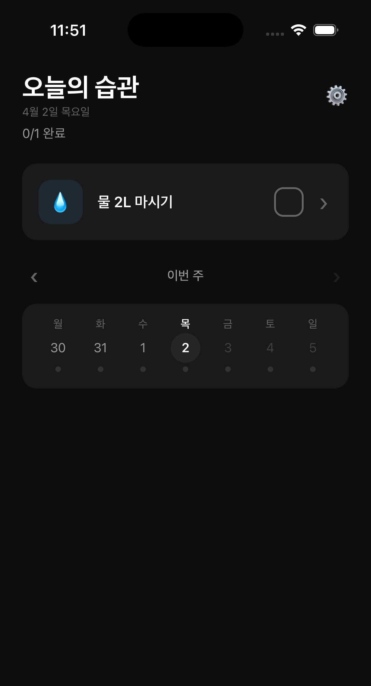

# Minimal Habit Tracker

> 딱 3개만 집중하세요. 많으면 지치고, 적으면 지켜져요.

<p align="center">
  
</p>

---

## 왜 만들었나요?

기존 습관 앱들은 너무 많은 걸 요구합니다. 습관을 무제한으로 추가하고, 설정할 것은 끝이 없고, 하루 빠지면 스트릭이 0이 됩니다. 결국 앱 자체를 안 열게 됩니다.

Minimal Habit Tracker는 다릅니다.

- **습관은 3개로 제한.** 정말 중요한 것만 남깁니다.
- **하루 빠져도 괜찮아요.** 흐름은 이어집니다.
- **5초면 끝.** 열고, 탭하고, 닫으세요.

---

## 주요 기능

### 핵심

| 기능 | 설명 |
|------|------|
| **딱 3개 습관** | 의도적 제약. 적을수록 지켜집니다 |
| **원탭 체크** | 앱 열고 탭 한 번. 5초면 충분합니다 |
| **이어가기** | 하루 빠져도 흐름이 끊기지 않아요 |

### 더 알아보기

| 기능 | 설명 |
|------|------|
| **주간 캘린더** | 이번 주 달성 현황을 한눈에. 스와이프로 지난 주도 확인 |
| **흐름 카운터** | 연속 달성 일수가 쌓이는 걸 보세요 |
| **축하 애니메이션** | 오늘의 습관을 모두 완료하면 컨페티가 터져요 |
| **알림** | 습관별 리마인더로 깜빡하지 않게 |
| **다크 모드** | 기본 다크. 라이트/시스템 모드도 지원 |

---

## 이어가기 — 하루 쉬어도 괜찮아요

다른 앱은 하루 빠지면 스트릭이 0이 됩니다.
연구에 따르면, 하루 빠지는 것은 습관 형성에 거의 영향이 없습니다.

```
● ● ◌ ● ● ●

● = 완료    ◌ = 쉼표 (흐름 유지)
```

- 하루 빠짐 = **쉼표** (흐름 이어짐)
- 이틀 연속 빠짐 = **새로운 시작**

> 쉼표가 있어도 문장은 이어지니까요.

---

## 설치 방법

### Android

아래 링크에서 APK를 다운로드하세요:

[APK 다운로드](https://expo.dev/accounts/daniel_hyun/projects/minimal-habit-tracker/builds/18495ca6-29e3-4eaa-885f-30bd9077aa63)

1. 링크를 눌러 APK 다운로드
2. 다운로드된 파일 열기
3. "출처를 알 수 없는 앱 설치 허용" 팝업이 뜨면 허용
4. 설치 완료

### iOS

준비 중입니다.

---

## 사용 방법

### 처음 시작할 때
1. 앱을 열면 추천 습관 목록이 나옵니다
2. 원하는 습관을 골라주세요 (최대 3개)
3. 직접 입력도 가능합니다
4. 사용 가이드를 확인하고 시작

### 매일 할 일
1. 앱을 열고
2. 완료한 습관을 탭해서 체크하고
3. 끝. 정말 이게 다입니다.

### 습관 수정
습관 카드를 **길게 누르면** 이름, 아이콘, 알림을 변경할 수 있습니다.

---

## 개인정보처리방침

[개인정보처리방침 보기](https://qlemql.github.io/privacy-policy/minimal-habit-tracker/)

모든 데이터는 기기에만 저장됩니다. 서버 없음. 계정 없음. 수집 없음.

---

## 피드백

사용하면서 불편한 점이나 좋았던 점을 알려주세요.

taehyun_fe@naver.com

---

*많으면 지치고, 적으면 지켜져요.*
